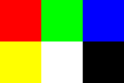
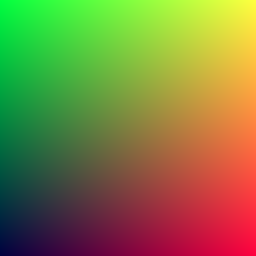

# Output an image

## PPM image format

```
P3
3 2
255
# The part here above is the header
# "P3" means this is a RGB color image in ASCII
# "3 2" means there are 3 columns (width) and 2 rows (height)
# "255" is the maximum value for each color
# The part here below is the image data
255   0   0   0 255   0   0   0 255
255 255   0 255 255 255   0   0   0
```

Result:



## Rendering a PPM image

`main.cpp`
```cpp
#include <iostream>

int main() {

    // Image

    const int image_width = 256;
    const int image_height = 256;

    //Render

    std::cout << "P3\n" << image_width << ' ' << image_height << "\n255\n";

    for (int j = image_height-1; j >= 0; --j) {
        std::cerr << "\rScanlines remaining: " << j << ' ' << std::flush;
        for (int i = 0; i < image_width; ++i) {
            auto r = static_cast<double>(i) / (image_width-1);
            auto g = static_cast<double>(j) / (image_height-1);
            auto b = 0.25;

            int ir = static_cast<int>(255.999 * r);
            int ig = static_cast<int>(255.999 * g);
            int ib = static_cast<int>(255.999 * b);

            std::cout << ir << ' ' << ig << ' ' << ib << '\n';
        }
    }
    std::cerr << "\nDone.\n";
}
```

In the above code:

* Pixels are written row by row, then from left to right.
* Rows are written from top to bottom.
* By convention, `R`, `G` and `B` range from `0.0` to `1.0`
    (this will be relaxed later via high dynamic range).
* `R` goes from fully black (since `i` starts at `0`) to fully on (since `i` ends at `image-width-1`). `G` goes from fully on to fully black (opposite of `i`). Since pixels are written row by row, from top to bottom, then column by column, from left to right, the resulting image shows a color gradient where:
    * the top left corner is roughly green,
    * the bottom left corner is roughly black,
    * the top right corner is roughly yellow (red + green),
    * the bottom right corner is roughly red.

Compiling and running the above code yields `image.ppm`, which, in a text editor, looks like
```
P3
256 256
255
0 255 63
1 255 63
2 255 63
...
253 0 63
254 0 63
255 0 63

```
and which, in an image editor / viewer, looks like



## Sources
* [_Ray Tracing in One Weekend_](https://raytracing.github.io/books/RayTracingInOneWeekend.html) (last consulted on March 18th, 2021)
* [Wikipedia](https://en.wikipedia.org/wiki/Netpbm#PPM_example) (last consulted on March 18th, 2021)