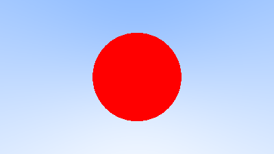

# Sphere-ray intersection(s)
Equation of a sphere of a radius _r_ with origin at _C = (Cx, Cy, Cz)_:

_(x - Cx) + (y - Cy) + (z - Cz) = r2_

Or in terms of vectors, for _P = (x, y, z)_:

_(P - C) . (P - C) = r2_

Any point _P_ satisfying the above equation is on the sphere.

If our ray _P(t) = A + tb_ intersects with the above sphere, there must some value(s) of t such that the above sphere equation is satisfied.

In other words, the ray intersects the sphere for any satisfying

_(P(t) - C) . (P(t) - C) = r2_

_(A + bt - C) . (A + bt - C) = r2_

t2b.b + 2tb . (A - C) + (A - C) . (A - C) - r2 = 0

Since this is a quadratic equations there are 0, 1 or 2 solutions, as shown on the website of [_Ray Tracing in One Weekend_](https://raytracing.github.io/books/RayTracingInOneWeekend.html) ([chapter 05](https://raytracing.github.io/books/RayTracingInOneWeekend.html#addingasphere)):

Result:

**Remark**: Solutions for _t < 0_, intersections happening **behind** the camera, work fine with the current code. This can be tested by changing the center of the sphere, e.g. from _(0, 0, -1)_ to _(0, 0, 1)_.

Note that in this case the rendering result will actually be the same in both cases, as shown here below.
Indeed, a ray with origin _A_ and direction _b_ intersects with the sphere in front of the camera at _(0, 0, -1)_, when _t > 0_, **AND** with the sphere behind the camera, when _t < 0_.

This issue will be fixed later.